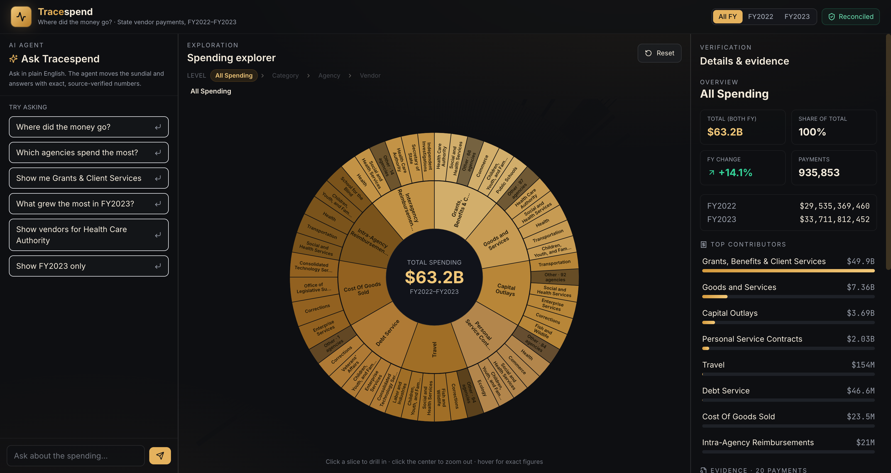
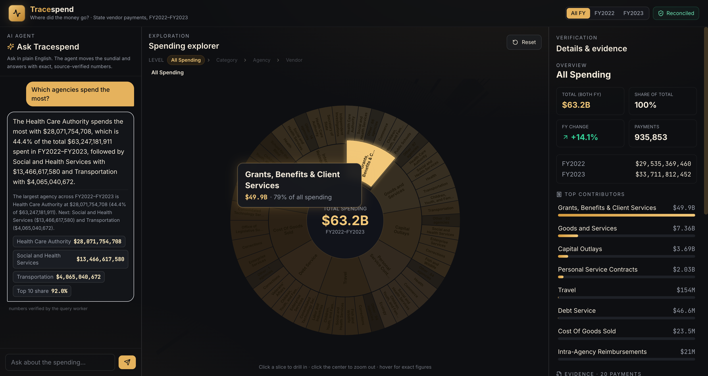

# Tracespend — *where did the money go?*

A working proof-of-concept that lets a non-technical city councilmember interrogate
**935,853 government vendor-payment records** as one animated **sundial** — by asking
plain-English questions. No SQL, no spreadsheets, no BI training.

Type *"which agencies spend the most?"* → the sundial rotates and zooms to that answer,
and a short, **source-verified** finding appears beside it. Click any arc to follow the
money further, from **Category → Agency → Vendor**.

> ▶ **Live demo:** _ https://tracespend.vercel.app _
> The frontend is static output on a CDN, so the sundial renders on first visit with
> **nothing to wake up**. Only asking a question invokes a server function.

**Stack:** TypeScript · React (Vite) · D3 · Express (Node ESM) · any OpenAI-compatible
model endpoint (default `gpt-4.1-nano`). **Data:** WA State Vendor-Payments 2021–23
(two fiscal-year CSVs, 935,853 rows, $63.2B), precompiled to two in-memory artifacts.

---

## What it looks like

The resting state — all 9 spending categories, then the agencies beneath them, sized by
dollars and drillable outward. The long tail of each ring folds into a clickable
**"Other"** arc, so nothing is dropped and the totals still reconcile:



**Ask a question → the sundial answers.** Plain English in; the chart zooms to the
answer, and the finding arrives with the exact figures that produced it — the AI's
sentence on top, the code-composed sentence and fact chips beneath it, and the raw
payments behind the selection on the right:


**Hover any arc** for its exact total and share; the rest of the chart dims so the
comparison stays readable:



---

## 1. Problem

**The user.** A newly seated **city councilmember** who has to vote on, defend, and
explain a budget made of hundreds of thousands of vendor payments. The data is public
and important — who does the government pay, how much, for what — but it arrives as a
217 MB export across two fiscal-year tabs. To get one story lead today you need pivot
tables or SQL. That's a wall between the person and the decision.

**The pain I addressed — making a number safe to repeat out loud.** The hard part isn't
finding *a* figure; it's knowing you can say it in a public meeting without being wrong.
A councilmember quoting a hallucinated total is a career problem, not a UX problem. So
the product is built around two jobs, in this order: **orientation** (where did it
actually go?) and **trust** (can I repeat this?). Every answer arrives with the exact
figures that produced it, and every figure reconciles to the source **to the cent**.

**Why this direction (over a dashboard or a chat box).**

- **A dashboard makes the user do the analysis** by staring at charts. A councilmember
  wants the conclusion, then the ability to dig. So the answer is *one finding + one
  focused view*, not ten widgets.
- **A pure chatbot hides structure — and cannot be trusted with dollars.** Spending is
  inherently hierarchical, so the hero is a chart you interrogate; the AI is the way
  *in*, never the output itself.
- **A bar chart or treemap** is honest about proportion but clumsy to drill, and the
  small-but-politically-charged line items vanish.

The result is one screen: a full-bleed sundial with an ask bar and a verify panel. Ask →
the whole chart breathes down to the answer. Value without the tools.

---

## 2. Tech & architectural choices

### How it works (one sentence)

The AI turns a question into a **structured query**; our code computes **every number**
and composes the factual sentence; the AI then only **rewords** that sentence, copying
each figure verbatim.

```
question ──▶ parseQuestion ──▶ Query{metric, groupBy, filters}
                (logged)              │
                                      ├─▶ normalize   → defaults, clamps, reject bad enums
                                      ├─▶ resolveName → canonical name, or a friendly "no match"
                                      ├─▶ runQuery    → exact numbers          (code, never AI)
                                      └─▶ compose     → the factual sentence   (code, never AI)
                                                          │
              factual sentence ──▶ summarize ──▶ one-line finding  (logged; numbers copied verbatim)
```

### Key decisions & trade-offs (named on purpose)

**AI parses intent; code owns the numbers.** The model only emits a query object and
rephrases a pre-computed sentence — it never adds up dollars. *Trade-off:* more prompt
engineering and a validation layer to maintain, in exchange for auditable, never
hallucinated figures. For someone quoting a budget in public, a wrong dollar amount is a
credibility disaster, so this line is non-negotiable.
→ [`server/ai.mjs`](server/ai.mjs) vs [`server/query-worker/`](server/query-worker/)

**Precompute, never compute live.** Two build steps turn the 217 MB of CSVs into a
sundial artifact and a dictionary-encoded, **integer-cent** snapshot the server loads in
~1 s; queries scan it in tens of ms. *Trade-off:* derived artifacts and full-scan queries
instead of an indexed database — and new data means a rebuild, not a live query. Right
for a POC; the CSVs stay the single source of truth (the artifacts are build output, like
compiled code).

**Money in integer cents, never floats.** Summing ~936K float dollars drifts. Cents don't.
*Trade-off:* one conversion at the edges, in exchange for a test that reconciles the query
worker back to an independently-built artifact **to the cent** — grand total, FY splits,
every category, top agencies and vendors.

**The sundial shows bounded rings, not all 96,907 vendors at once.** Each ring is
deliberately sparse: 9 categories, then the top agencies per category and top vendors per
agency, with the long tail folded into a clickable **"Other"** arc that pages into the
next ring. *Trade-off:* "everything at once" for legibility. Nothing is hidden — totals
always reconcile, and the top 5,000 vendors stay searchable by name.

**One model endpoint, not a provider abstraction.** Answering speaks the OpenAI
chat-completions wire format to one configured target. OpenAI, OpenRouter, Groq,
Anthropic's compatible endpoint, and a local Ollama all take the same path — three env
vars, no code branch. *Trade-off:* we hand-handle the places "OpenAI-compatible" isn't
(`max_tokens` vs `max_completion_tokens`; models that refuse `temperature`) rather than
inheriting an SDK's coverage. Each concession is deliberate and named in
[`server/model-endpoint.mjs`](server/model-endpoint.mjs); nothing is dropped blindly.

**Reimbursements are INCLUDED by default.** Interagency and intra-agency transfers are
real ledger entries, so the default total is the ledger total. Excluding them is an
explicit, opt-in filter rather than a silent one — a default that quietly shrinks a
number is exactly the kind of thing a councilmember gets caught out by.

**Temperature 0 everywhere.** Neither job wants creativity: choosing a query is
classification, and rewording must not drift from a sentence whose numbers are already
correct. Fixed at the single call site so no future caller can reintroduce variation.

### Data handling for the AI (hard constraint)

Every input sent to the model — **and every reply that comes back** — passes through one
choke-point, [`server/ai-input-log.mjs`](server/ai-input-log.mjs), recording the
timestamp, the model name, the exact payload, and the numbers the query worker computed.
Payloads are deliberately tiny (a question, or one already-correct sentence) — **never
raw rows** — which keeps logging trivial and avoids sending the dataset to a third party.
Logging both directions is what turns an opaque parse failure into a visible cause. In
production this would write to a managed sink (Datadog / BigQuery) with retention and PII
review.


---

## 3. AI usage log

Three significant moments where I worked with — and pushed back on — the AI (Claude Code
as the pair-programmer; the configured endpoint in-app).

### 1 — "Let the AI do the math" → rejected

The obvious pipeline was to hand the model the matching rows and let it compute and
summarize. I watched it round figures and, once, invent a total. Now the AI only
interprets intent ([`ai.mjs`](server/ai.mjs)) and a deterministic worker computes
([`query-worker/`](server/query-worker/)) — auditable numbers over open-ended chat.

### 2 — A scoped fact became a false global claim → redirected *(the key moment)*

*"Explain MOLINA HEALTHCARE OF WASHIN"* produced a **valid but self-cancelling** query —
filter to one vendor, then rank vendors — so it won its own ranking at "100.0% of
$388,668,593", and rewording dropped the scope into "the biggest vendor in FY2022–FY2023".
Every digit was copied correctly; the *meaning* wasn't. **A guardrail that protects digits
does not protect truth** — so `normalizeQuery` now collapses a group-by already pinned by
its own filter, and "Top 1 share: 100%" is gone. Both regression-tested.

### 3 — Two parsing bugs caught by testing against ground truth

**(a)** *"What changed from 2022 to 2023?"* set a single-year filter and collapsed the
trend to one point — fixed by a prompt rule **and** a code guard, because a rule the model
can ignore isn't a rule. **(b)** "Dept of Fish & Wildlife" matched nothing and returned a
confident **$0**; names now resolve to canonical, and a miss says so out loud.

### The line I drew

> The AI may interpret intent and phrase language. It may never produce a number, and it
> may never decide what a number means. Both of those live in code.

---

## Running it

```bash
# 1. install
npm install

# 2. build the two artifacts from the CSVs in data/  (one time)
npm run build:data      # sundial artifact  -> public/artifacts/spending.json  (~40s)
npm run build:worker    # encoded dataset   -> server/artifacts/dataset.json   (~16s)

# 3. add a model key (optional — the sundial works entirely without one)
cp .env.example .env    # then set MODEL_API_KEY

# 4. run (web :5173, proxying /api to the server on :8787)
npm run dev             # terminal 1 — http://localhost:5173
npm run server          # terminal 2 — only needed for asking 
```

